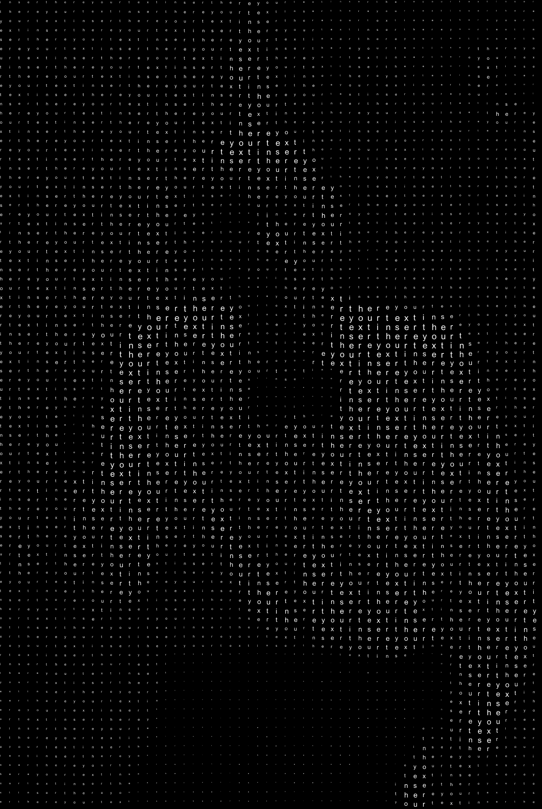

# HalftoneGlyph
Halftone Glyph, a tool inspired by the [halftone](https://en.wikipedia.org/wiki/Halftone) printing technique, generates images in which pixels are substituted by characters.
The brightness of the pixel is encoded with the size of the character.

## Usage
Download and run the sketch in Processing. Modify the configuration section of the *HalftoneGlyph.pde* file as you wish. You can choose:
- image to convert
- image output name
- font
- characters to draw the image
- max size of the characters
- color of characters and background (white on black / black on white)

## How does it work?
Halftone Glyph converts the image in grayscale and it decreases the amount of pixels in order to match each pixel with a character (tile). Then, it gets the brightness value of each pixel and it maps it to the size of the character. All the characters in the input string are drawn in sequential order and when each of them has occupied a tile, Halftone Glyph starts to draw the string over.
